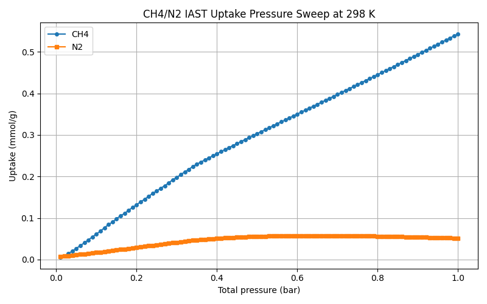
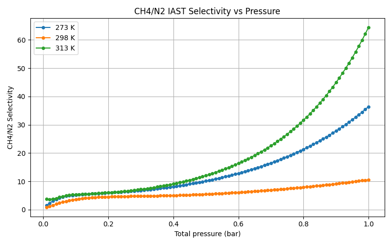
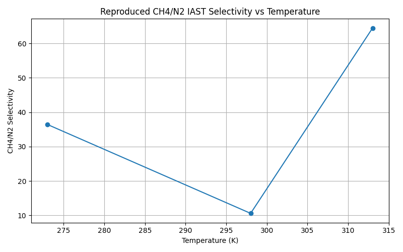

# IAST Results Summary

## Purpose of IAST
IAST was used to convert pure-component adsorption isotherms into realistic mixed-gas adsorption predictions for Al-Fum. The calculations quantify how strongly Al-Fum prefers methane over nitrogen under a range of pressures and temperatures.

## Methodology
- Pure-gas adsorption data were taken from `data/ch4_273K.csv`, `data/ch4_298K.csv`, `data/ch4_313K.csv`, and the matching N2 files.
- Methane isotherms were fit using a Langmuir model in pyIAST.
- Nitrogen isotherms were handled with an interpolator and a conservative fill value at the highest measured uptake.
- Mixed-gas IAST predictions were calculated for a 50:50 CH4/N2 gas-phase mixture across a total pressure sweep from 0.01 to 1.0 bar.

## Simulation Conditions
- Temperatures evaluated: 273 K, 298 K, 313 K
- Pressure range evaluated: 0.01 to 1.0 bar total pressure
- Gas mixture evaluated: CH4/N2 binary mixture at 50:50 gas-phase composition
- Adsorbate loadings reported in mmol/g
- Selectivity reported as CH4/N2 adsorption selectivity at equal gas-phase composition

## Output Files
- `results/data/pressure_sweep_ch4_n2.csv` — Full mixed-gas prediction table for the CH4/N2 sweep
- `results/data/reproduce_huang.csv` — Final 1-bar CH4/N2 IAST reproduction data and literature comparison
- `results/figures/pressure_sweep_uptake_298K.png` — Uptake vs pressure at 298 K
- `results/figures/selectivity_vs_pressure_all_temps.png` — Selectivity vs pressure across all temperatures
- `results/figures/reproduce_huang_selectivity.png` — Selectivity vs temperature at 0.5 bar CH4/N2

## Final Mixed-Gas Prediction Table (1 bar)
The full prediction dataset is available in `results/data/pressure_sweep_ch4_n2.csv`. The table below shows the final 1-bar mixed-gas results for each temperature.

| Temperature (K) | Total Pressure (bar) | CH4 Partial Pressure (bar) | N2 Partial Pressure (bar) | CH4 Loading (mmol/g) | N2 Loading (mmol/g) | CH4/N2 Selectivity |
|---|---|---|---|---|---|---|
| 273 | 1.00 | 0.50 | 0.50 | 0.92792 | 0.02547 | 36.43 |
| 298 | 1.00 | 0.50 | 0.50 | 0.54329 | 0.05135 | 10.58 |
| 313 | 1.00 | 0.50 | 0.50 | 0.42876 | 0.00665 | 64.46 |

## Figures

### `results/figures/pressure_sweep_uptake_298K.png`

This plot shows the predicted methane and nitrogen uptakes as a function of total pressure at 298 K. It demonstrates that methane uptake is substantially larger than nitrogen uptake in the mixed-gas case.

### `results/figures/selectivity_vs_pressure_all_temps.png`

This figure shows CH4/N2 selectivity across the 0.01–1.0 bar pressure sweep for 273 K, 298 K, and 313 K. It highlights the temperature dependence of methane preferential adsorption.

### `results/figures/reproduce_huang_selectivity.png`

This additional figure shows the reproduced selectivity values at a fixed 1-bar total pressure (0.5 bar CH4 + 0.5 bar N2) as a function of temperature.

## Key Findings
- Al-Fum strongly prefers methane over nitrogen across the evaluated pressure range.
- At 1 bar and a 50:50 CH4/N2 gas mixture:
  - 273 K: selectivity ≈ 36.4
  - 298 K: selectivity ≈ 10.6
  - 313 K: selectivity ≈ 64.5
- Methane uptake remains significantly higher than nitrogen uptake at 298 K, reinforcing the strong adsorption preference.
- The full predicted dataset in `results/data/pressure_sweep_ch4_n2.csv` provides 100 pressure points for each temperature, enabling further analysis or plotting.

## Conclusion
IAST was used to convert pure-component adsorption isotherms into realistic mixed-gas adsorption predictions. The mixed-gas simulations indicate strong methane preference in Al-Fum across the evaluated pressure range, with methane exhibiting substantially higher adsorption than competing gases. These results support the potential of Al-Fum as a promising adsorbent for methane capture and separation applications.
